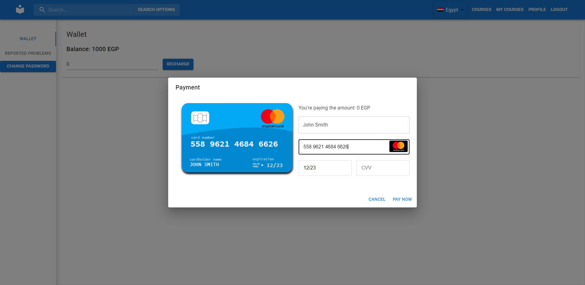
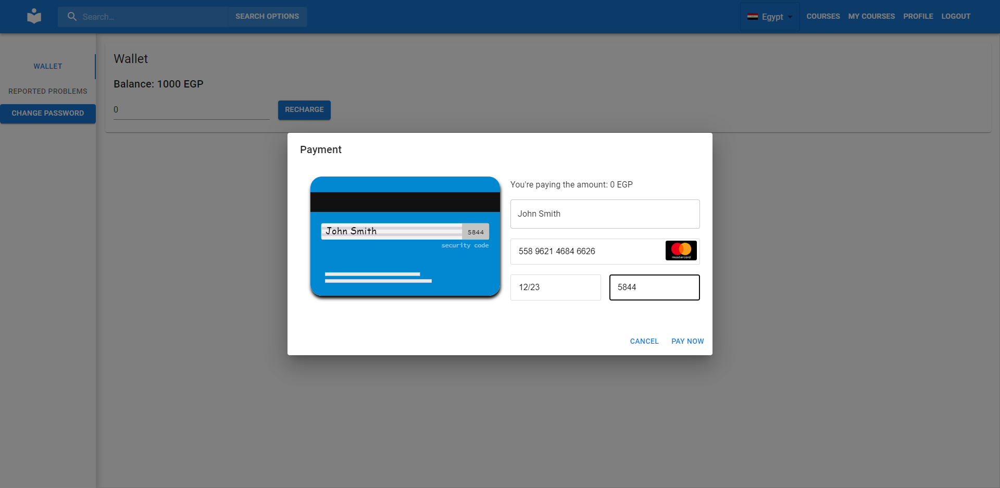

# Test-in-Evaluation

## Project Title

An Online Learning and Teaching Platform

## Motivation

This project was created part of the course `CSEN704 Advanced Computer lab` in the German University in Cairo.

## Build Status

Project builds successfully and is fully functional. However, project is currently in development and improvements could be made.

## Code Style

We used a prettier config file to ensure professional code formatting. The config we used is the default standard one.

## Screenshots





## Frameworks Used

We used the MERN (Mongo-Express-React-Nodejs) framework. We also used typescript for both the backend and the frontend

We also used:

-   MUI for UI components.
-   Axios for requests management between client and server.
-   nodemailer for emails.
-   Mongoose as an ORM.

## Features

-   Guests are allowed to use the site with limited functionality
-   Signup to the website
-   Receive a password reset email
-   Corporations can use the platform with features tailored to corporate trainees to teach their employees
-   Report, follow-up and resolve a problem all on the platform
-   Rate courses and see other people'es ratings
-   Filter courses by custom criteria
-   Solve exercises on the platform and receive a grade
-   Get a certificate when you complete a course
-   View your wallet balance
-   Set promotions as an admin or an instructor
-   Create multiple choice exams as an instructor
-   Add videos to your courses as an instructor

## Code Examples

API endpoints for example are created as follows where every endpoint has a unique file:

```js
const path = "/api/create_course" as const;

const section = Record({
    title: String,
    description: String,
    totalHours: Number,
    videoUrl: String,
    exam: Record({
        exercises: Array(
            Record({
                question: String,
                answers: Array(String),
                correctAnswer: Number,
            }).withConstraint(
                (excercise) =>
                    excercise.answers.length > 1 &&
                    typeof excercise.answers[excercise.correctAnswer] ===
                        "string"
            )
        ),
    }),
});

const Input = Record({
    title: String,
    subject: String,
    summary: String,
    price: Number,
    sections: Array(section).withConstraint((sections) => sections.length > 0),
    videoPreviewUrl: String,
});

type Input = Static<typeof Input>;

export const addRoute = (app: Express) => {
    app.post(
        path,
        validateInput(Input),
        async (req: Request<Input>, res: Response) => {
            if (req.session.data.userType !== UserTypes.instructor)
                return res.status(400).send({ error: "unauthorized" });

            const {
                price,
                sections,
                subject,
                summary,
                title,
                videoPreviewUrl,
            } = req.body;
            const totalHours = sections
                .map((v) => v.totalHours)
                .reduce((a, b) => a + b);
            const instructorId = await User.findOne({
                username: req.session.data.username,
            }).then((v) => v?._id);
            const subjectId = subject
                ? await Subject.findOneAndUpdate(
                      { Name: subject },
                      { Name: subject },
                      { upsert: true, new: true }
                  ).then((v) => v?._id)
                : undefined;
            const course = await Course.create({
                price,
                subjectId: subjectId,
                summary,
                title,
                totalHours,
                instructor: instructorId!,
                videoPreviewUrl,
            });

            await Promise.all(
                sections.map(
                    (
                        { description, title, totalHours, videoUrl, exam },
                        index
                    ) =>
                        Section.create({
                            description,
                            name: title,
                            parentCourse: course._id,
                            totalHours,
                            videoUrl: videoUrl,
                            exam: exam,
                            index,
                        })
                )
            );

            return res.send({ ok: true });
        }
    );
};
```

## Installation

1. Make sure you have `npm` and `node` installed

2. Go into the `server` directory and run `npm i`

3. Create a `.env` file, using `.env.example` as a template

4. Run `node .`

5. From the parent directory, go into the `client` directory and run `npm i`

6. Run `npm start`

## API reference

### `POST /api/contract`

#### Params

```
{}
```

### `POST /api/accept_refund`

#### Params

```
{
    enrollmentId: String,
}
```

### `POST /api/set_subtitle_exercise`

#### Params

```
{
    courseId: String,
    sectionId: String,
    exercises: Array(
        Record({
            question: String,
            answers: Array(String),
            correctAnswer: Number,
        })
    ),
}
```

### `POST /api/add_student_to_course`

#### Params

```
{
    studentId: String,
    courseId: String,
}
```

### `POST /api/change_current_password`

#### Params

```
{
    currentPassword: String,
    newPassword: String,
}
```

### `POST /api/change_my_profile`

#### Params

```
{
    email: String.optional(),
    bio: String.optional(),
}
```

### `POST /api/create_course`

#### Params

```
{
    title: String,
    subject: String,
    summary: String,
    price: Number,
    sections: Array(section).withConstraint((sections) => sections.length > 0),
    videoPreviewUrl: String,
}
```

### `POST /api/create_subject`

#### Params

```
{
    Name: String,
}
```

### `POST /api/create_user`

#### Params

```
{
    username: String.withConstraint((s) => s.length > 5),
    password: String.withConstraint((s) => s.length > 8),
    firstName: String.withConstraint((s) => s.length > 0),
    lastName: String.withConstraint((s) => s.length > 0),
    email: String.withConstraint((s) => s.length > 0),
    gender: Union(Literal("male"), Literal("female")),
    type: String,
}
```

### `POST /api/enroll_in_course`

#### Params

```
{
    courseId: String,
}
```

### `POST /api/follow_up_on_reported_problem`

#### Params

```
{
    reportedProblemId: String,
    newComment: String,
    userId: String,
}
```

### `POST /api/forgot_password`

#### Params

```
{
    email: String,
}
```

### `POST /api/gen_notes_pdf`

#### Params

```
{
    notes: String,
}
```

### `GET /api/get_corp_users`

#### Params

```
{}
```

### `GET /api/get_all_instructors`

#### Params

```
{}
```

### `GET /api/get_all_reported_problems`

#### Params

```
{}
```

### `POST /api/get_all_reviews`

#### Params

```
{
    reviewed: String,
}
```

### `GET /api/get_all_subjects`

#### Params

```
{}
```

### `GET /api/get_certificate`

#### Params

```
{}
```

### `POST /api/get_completed_course_ratio`

#### Params

```
{
    courseId: String,
}
```

### `POST /api/get_course`

#### Params

```
{
    courseId: String,
}
```

### `POST /api/get_course_preview`

#### Params

```
{
    courseId: String,
}
```

### `POST /api/get_enrollment_aggregation`

#### Params

```
{
    courseId: String,
}
```

### `POST /api/get_is_enrolled`

#### Params

```
{
    courseId: String,
}
```

### `GET /api/get_my_enrollments`

#### Params

```
{}
```

### `GET /api/getMyReportedProblems/:id`

#### Params

```
{}
```

### `GET /api/get_pending_enrollments`

#### Params

```
{}
```

### `GET /api/get_pending_refunds`

#### Params

```
{}
```

### `POST /api/get_user`

#### Params

```
{
    userId: String,
}
```

### `POST /api/login`

#### Params

```
{
    username: String,
    password: String,
}
```

### `POST /api/logout`

#### Params

```
{}
```

### `POST /api/mark_reported_problem`

#### Params

```
{
    reportedProblemId: String,
    newStatus: String,
}
```

### `POST /api/pay_to_wallet`

#### Params

```
{
    amount: Number,
}
```

### `POST /api/record_completed_exercise`

#### Params

```
{
    sectionId: String,
}
```

### `POST /api/record_completed_video`

#### Params

```
{
    sectionId: String,
}
```

### `POST /api/report_problem`

#### Params

```
{
    courseId: String,
    title: String,
    description: String,
    category: String,
}
```

### `POST /api/request_refund`

#### Params

```
{
    enrollmentId: String,
}
```

### `POST /api/resolve_pending_enrollment`

#### Params

```
{
    enrollmentId: String,
    accepted: Boolean,
}
```

### `POST /api/search_courses`

#### Params

```
{
    subject: String.optional(),
    title: String.optional(),
    instructor: String.optional(),

    // inclusive,inclusive
    ratingLow: Number.optional(),
    ratingHigh: Number.optional(),

    //inclusive,inclusive
    priceLow: Number.optional(),
    priceHigh: Number.optional(),
}
```

### `POST /api/set_country`

#### Params

```
{
    country: String,
}
```

### `POST /api/set_course_discount`

#### Params

```
{
    discount: Number.withConstraint((n) => n >= 0 && n <= 1, {
        name: "discount must be between 0 and 1",
    }),
    endDateTimestamp: Number, // timestamp in milliseconds
    startDateTimestamp: Number, // timestamp in milliseconds
    courseId: String,
}
```

### `POST /api/sign_up`

#### Params

```
{
    username: String,
    password: String.withConstraint((s) => s.length > 8),
    firstName: String.withConstraint((s) => s.length > 0),
    lastName: String.withConstraint((s) => s.length > 0),
    email: String.withConstraint((s) => s.length > 0),
    gender: Union(Literal("male"), Literal("female")),
}
```

### `POST /api/solve_exercise`

#### Params

```
{
    sectionId: String,
    answers: Array(Number),
}
```

### `GET /api/<MyMethod>`

#### Params

```
{}
```

### `POST /api/view_exercise_result`

#### Params

```
{
    sectionId: String,
}
```

### `GET /api/who_am_i`

#### Params

```
{}
```

### `POST /api/write_review`

#### Params

```
{
    reviewed: String,
    score: Number,
    text: String,
}
```

## Tests

We had a peer review system where changes are done in branches and then is reviewed by others before being merged to master.

## How to use

After preforming the installation, simply navigate to the URL return by the `npm start` command

## Contribute

Contributions are always welcome!
Please fork the project, do your additions then open a pull request!

## Credits

-   Ahmed Mamdouh
-   Akram Fahim
-   Karim Mohamed
-   Mahmoud Gaber
-   Noureldin Hesham

## License

[GNU GPL v3](https://www.gnu.org/licenses/gpl-3.0.txt)
