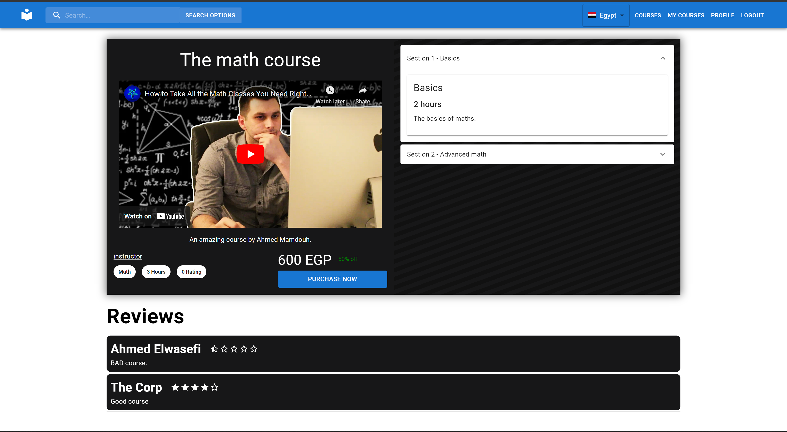
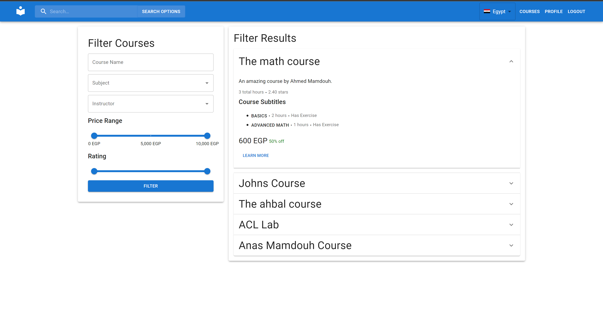

# Test-in-Evaluation

## Project Title

An Online Learning and Teaching Platform

## Motivation

The motivation for this project was to create an online learning and teaching platform that would allow users to access educational resources created by instructors. This project was developed as part of the `CSEN704 Advanced Computer lab` course at the German University in Cairo, and was designed to showcase the skills and knowledge that the students had acquired during the semester. The goal was to create a platform that would be useful and accessible to a wide range of users, including individual learners, corporations, and instructors. We hope that this project will provide a valuable resource for anyone looking to learn new skills or share their knowledge with others.

## Build Status


Project builds successfully and is fully functional. However, project is currently in development and improvements could be made.

## Code Style

The code style used in this project is based on the standard prettier configuration, which ensures consistent and professional formatting across the codebase. By using a shared configuration, we can ensure that the code is easy to read and maintain, making it easier for new contributors to understand and work with the code. We encourage all contributors to follow the code style guidelines and to use the prettier configuration to ensure that the code remains consistent and easy to read.

## Screenshots






## Frameworks Used

We used the MERN (Mongo-Express-React-Nodejs) framework. We also used typescript for both the backend and the frontend

We also used:

-   MUI for UI components.
-   Axios for requests management between client and server.
-   nodemailer for emails.
-   Mongoose as an ORM.

## Features

-   Guests are allowed to use the site with limited functionality
-   Signup to the website
-   Receive a password reset email
-   Corporations can use the platform with features tailored to corporate trainees to teach their employees
-   Report, follow-up and resolve a problem all on the platform
-   Rate courses and see other people'es ratings
-   Filter courses by custom criteria
-   Solve exercises on the platform and receive a grade
-   Get a certificate when you complete a course
-   View your wallet balance
-   Set promotions as an admin or an instructor
-   Create multiple choice exams as an instructor
-   Add videos to your courses as an instructor

## Code Examples

### Client

React components are used to represent pages as well as smaller reusable components in the frontend

```js
const ProfileCorporatePage = () => {
    const navigate = useNavigate();
    const [optionTab, setOptionTab] = useState("requestedCourses");

    return (
        <Box
            sx={{
                background: "white",
                display: "flex",
                minHeight: "calc(100% + 1rem)",
                translate: "0 -1rem 0",
            }}
        >
            <Tabs
                sx={{
                    paddingY: "2.5rem",
                    borderRight: 1,
                    borderColor: "divider",
                    boxShadow: "rgba(0, 0, 0, 0.3) 0px 5px 15px",
                }}
                value={optionTab}
                orientation="vertical"
                onChange={(event, value) => {
                    setOptionTab(value);
                }}
            >
                <Tab label="Course Requests" value="requestedCourses" />
                <Tab label="Reported Problems" value="reportedProblems" />
                <Button
                    onClick={() => {
                        navigate("/change_password");
                    }}
                    sx={{ float: "down" }}
                    variant="contained"
                >
                    Change Password
                </Button>
            </Tabs>
            <Box
                sx={{
                    flexGrow: 1,
                    p: 2,
                    border: "1px solid #e0e0e0",
                }}
            >
                {optionTab === "requestedCourses" && <RequestedCourses />}
                {optionTab === "reportedProblems" && <ReportedProblems />}
            </Box>
        </Box>
    );
};

export default ProfileCorporatePage;
```

### Server

API endpoints for example are created as follows where every endpoint has a unique file:

```js
const path = "/api/create_course" as const;

const section = Record({
    title: String,
    description: String,
    totalHours: Number,
    videoUrl: String,
    exam: Record({
        exercises: Array(
            Record({
                question: String,
                answers: Array(String),
                correctAnswer: Number,
            }).withConstraint(
                (excercise) =>
                    excercise.answers.length > 1 &&
                    typeof excercise.answers[excercise.correctAnswer] ===
                        "string"
            )
        ),
    }),
});

const Input = Record({
    title: String,
    subject: String,
    summary: String,
    price: Number,
    sections: Array(section).withConstraint((sections) => sections.length > 0),
    videoPreviewUrl: String,
});

type Input = Static<typeof Input>;

export const addRoute = (app: Express) => {
    app.post(
        path,
        validateInput(Input),
        async (req: Request<Input>, res: Response) => {
            if (req.session.data.userType !== UserTypes.instructor)
                return res.status(400).send({ error: "unauthorized" });

            const {
                price,
                sections,
                subject,
                summary,
                title,
                videoPreviewUrl,
            } = req.body;
            const totalHours = sections
                .map((v) => v.totalHours)
                .reduce((a, b) => a + b);
            const instructorId = await User.findOne({
                username: req.session.data.username,
            }).then((v) => v?._id);
            const subjectId = subject
                ? await Subject.findOneAndUpdate(
                      { Name: subject },
                      { Name: subject },
                      { upsert: true, new: true }
                  ).then((v) => v?._id)
                : undefined;
            const course = await Course.create({
                price,
                subjectId: subjectId,
                summary,
                title,
                totalHours,
                instructor: instructorId!,
                videoPreviewUrl,
            });

            await Promise.all(
                sections.map(
                    (
                        { description, title, totalHours, videoUrl, exam },
                        index
                    ) =>
                        Section.create({
                            description,
                            name: title,
                            parentCourse: course._id,
                            totalHours,
                            videoUrl: videoUrl,
                            exam: exam,
                            index,
                        })
                )
            );

            return res.send({ ok: true });
        }
    );
};
```

## Installation

1. Make sure you have `npm` and `node` installed
2. Go into the `server` directory and run `npm i`
3. Create a `.env` file, using `.env.example` as a template
4. Run `node .`
5. From the parent directory, go into the `client` directory and run `npm i`
6. Run `npm start`

## API reference

### `POST /api/accept_refund`

#### Params

```js
{
    enrollmentId: String,
}
```

#### Description

Allows an admin to accept a refund requested by a trainee for a specific course

### `POST /api/set_subtitle_exercise`

#### Params

```js
{
    courseId: String,
    sectionId: String,
    exercises: Array(
        Record({
            question: String,
            answers: Array(String),
            correctAnswer: Number,
        })
    ),
}
```

### `POST /api/add_student_to_course`

#### Params

```js
{
    studentId: String,
    courseId: String,
}
```

#### Description

Allows an admin to add a trainee to a course

### `POST /api/change_current_password`

#### Params

```js
{
    currentPassword: String,
    newPassword: String,
}
```

#### Description

Allows a user to change their current password

### `POST /api/change_my_profile`

#### Params

```js
{
    email: String.optional(),
    bio: String.optional(),
}
```

#### Description

Allows a user to change their own bio

### `POST /api/create_course`

#### Params

```js
{
    title: String,
    subject: String,
    summary: String,
    price: Number,
    sections: Array(section).withConstraint((sections) => sections.length > 0),
    videoPreviewUrl: String,
}
```

#### Description

Allows an instructor to create a course

### `POST /api/create_subject`

#### Params

```js
{
    Name: String,
}
```

#### Description

Allows an admin to create a new subject ( categories for courses )

### `POST /api/create_user`

#### Params

```js
{
    username: String.withConstraint((s) => s.length > 5),
    password: String.withConstraint((s) => s.length > 8),
    firstName: String.withConstraint((s) => s.length > 0),
    lastName: String.withConstraint((s) => s.length > 0),
    email: String.withConstraint((s) => s.length > 0),
    gender: Union(Literal("male"), Literal("female")),
    type: String,
}
```

#### Description

Allows an admin to create a new user

### `POST /api/contract`

#### Params

```js
{
}
```

#### Description

Allows an instructor to accept their contract

### `POST /api/enroll_in_course`

#### Params

```js
{
    courseId: String,
}
```

#### Description

Allows a trainee to enroll in a course

### `POST /api/follow_up_on_reported_problem`

#### Params

```js
{
    reportedProblemId: String,
    newComment: String,
    userId: String,
}
```

#### Description

Allows a user(including admins) to follow up on a reported problem

### `POST /api/forgot_password`

#### Params

```js
{
    email: String,
}
```

#### Description

Allows a user to request a password reset

### `POST /api/gen_notes_pdf`

#### Params

```js
{
    notes: String,
}
```

#### Description

Allows a user to generate a pdf file from their notes

### `GET /api/get_corp_users`

#### Params

```js
{
}
```

#### Description

Allows an admin to get all corporate trainees

### `GET /api/get_all_instructors`

#### Params

```js
{
}
```

#### Description

Allows an user to get all instructors

### `GET /api/get_all_reported_problems`

#### Params

```js
{
}
```

#### Description

Allows a user to get all reported problems

### `POST /api/get_all_reviews`

#### Params

```js
{
    reviewed: String,
}
```

#### Description

Allows a user to get all reviews for a specific entity

### `GET /api/get_all_subjects`

#### Params

```js
{
}
```

#### Description

Allows a user to get all subjects

### `GET /api/get_certificate`

#### Params

```js
{
    enrollmentId: String,
}
```

#### Description

Allows a user to get their certificate

### `POST /api/get_completed_course_ratio`

#### Params

```js
{
    courseId: String,
}
```

#### Description

Allows a user to get the completion ratio of a course

### `POST /api/get_course`

#### Params

```js
{
    courseId: String,
}
```

#### Description

Allows a user to get a detailed course

### `POST /api/get_course_preview`

#### Params

```js
{
    courseId: String,
}
```

#### Description

Allows a user to get a preview of a course

### `POST /api/get_enrollment_aggregation`

#### Params

```js
{
    courseId: String,
}
```

#### Description

Allows a user to get the number of enrollments and the sum of the prices of all enrollments for a specific course

### `POST /api/get_is_enrolled`

#### Params

```js
{
    courseId: String,
}
```

#### Description

Allows a user to get their enrollment status for a specific course

### `GET /api/get_my_enrollments`

#### Params

```js
{
}
```

#### Description

Allows a user to get all their enrollments

### `GET /api/getMyReportedProblems/:id`

#### Params

```js
{
}
```

#### Description

Allows a user to get all their reported problems

### `GET /api/get_pending_enrollments`

#### Params

```js
{
}
```

#### Description

Allows an admin to get all pending enrollments

### `GET /api/get_pending_refunds`

#### Params

```js
{
}
```

#### Description

Allows an admin to get all pending refunds

### `POST /api/get_user`

#### Params

```js
{
    userId: String,
}
```

#### Description

Allows an admin to get a user

### `POST /api/login`

#### Params

```js
{
    username: String,
    password: String,
}
```

#### Description

Allows a user to login

### `POST /api/logout`

#### Params

```js
{
}
```

#### Description

Allows a user to logout

### `POST /api/mark_reported_problem`

#### Params

```js
{
    reportedProblemId: String,
    newStatus: String,
}
```

#### Description

Allows an admin to mark a reported problem as solved

### `POST /api/pay_to_wallet`

#### Params

```js
{
    amount: Number,
}
```

#### Description

Allows a user to pay to their wallet

### `POST /api/record_completed_exercise`

#### Params

```js
{
    sectionId: String,
}
```

#### Description

Allows a trainee to record that they have completed an exercise

### `POST /api/record_completed_video`

#### Params

```js
{
    sectionId: String,
}
```

#### Description

Allows a trainee to record that they have completed a video

### `POST /api/report_problem`

#### Params

```js
{
    courseId: String,
    title: String,
    description: String,
    category: String,
}
```

#### Description

Allows a user to report a problem

### `POST /api/request_refund`

#### Params

```js
{
    enrollmentId: String,
}
```

#### Description

Allows a user to request a refund if 50% of the course has not been completed

### `POST /api/resolve_pending_enrollment`

#### Params

```js
{
    enrollmentId: String,
    accepted: Boolean,
}
```

#### Description

Allows an admin to resolve a pending enrollment

### `POST /api/search_courses`

#### Params

```js
{
    subject: String.optional(),
    title: String.optional(),
    instructor: String.optional(),

    // inclusive,inclusive
    ratingLow: Number.optional(),
    ratingHigh: Number.optional(),

    //inclusive,inclusive
    priceLow: Number.optional(),
    priceHigh: Number.optional(),
}
```

#### Description

Allows a user to search for courses

### `POST /api/set_country`

#### Params

```js
{
    country: String,
}
```

#### Description

Allows a user to set their country

### `POST /api/set_course_discount`

#### Params

```js
{
    discount: Number.withConstraint((n) => n >= 0 && n <= 1, {
        name: "discount must be between 0 and 1",
    }),
    endDateTimestamp: Number, // timestamp in milliseconds
    startDateTimestamp: Number, // timestamp in milliseconds
    courseId: String,
}
```

#### Description

Allows an admin or instructor to set a discount for a course

### `POST /api/sign_up`

#### Params

```js
{
    username: String,
    password: String.withConstraint((s) => s.length > 8),
    firstName: String.withConstraint((s) => s.length > 0),
    lastName: String.withConstraint((s) => s.length > 0),
    email: String.withConstraint((s) => s.length > 0),
    gender: Union(Literal("male"), Literal("female")),
}
```

#### Description

Allows a user to sign up as an individual trainee

### `POST /api/solve_exercise`

#### Params

```js
{
    sectionId: String,
    answers: Array(Number),
}
```

#### Description

Allows a trainee to solve an exercise

### `POST /api/view_exercise_result`

#### Params

```js
{
    sectionId: String,
}
```

#### Description

Allows a trainee to view the result of an exercise

### `GET /api/who_am_i`

#### Params

```js
{
}
```

#### Description

Allows a user to get their user info

### `POST /api/write_review`

#### Params

```js
{
    reviewed: String,
    score: Number,
    text: String,
}
```

#### Description

Allows a user to write a review

## Tests
To ensure the quality and functionality of the code, we have implemented a code review process in which changes to the codebase are reviewed by other team members before being merged into the main branch. This process allows us to catch potential issues and ensure that the code is well-written and follows best practices. In addition to the code review process, we have also tested the project manually using the postman tool to ensure that all API endpoints are functioning as expected. By using a combination of code reviews and manual testing, we can be confident that the project is reliable and ready for use.

## How to use

To use this project, first make sure you have npm and node installed. Next, navigate to the server directory and run npm i. Create a .env file using .env.example as a template, then run node .. Finally, navigate to the client directory and run npm i, then npm start to start the application. This will start the client server, and you can access the website by navigating to the URL returned from npm start in your web browser. This will allow you to access the full range of features available on the Online Learning and Teaching Platform.

## Contribute

We welcome contributions and suggestions for improvement, and we are always looking for ways to make the project better. If you have any ideas or would like to get involved, please don't hesitate to reach out.
Please fork the project, do your additions then open a pull request!

## Credits
This project was developed as part of the `CSEN704 Advanced Computer Lab` course at the German University in Cairo. We would like to extend our thanks to the teaching assistants who provided guidance and support throughout the project. We would also like to acknowledge the open source libraries and frameworks that were used in the development of this project, including the MERN stack (MongoDB, Express, React, and Node.js), MUI, Axios, nodemailer, and Mongoose. Without the contributions of these tools and the community behind them, this project would not have been possible. Thank you.

The team behind the project: 
-   Ahmed Mamdouh
-   Akram Fahim
-   Karim Mohamed
-   Mahmoud Gaber
-   Noureldin Hesham

## License

[GNU GPL v3](https://www.gnu.org/licenses/gpl-3.0.txt)
