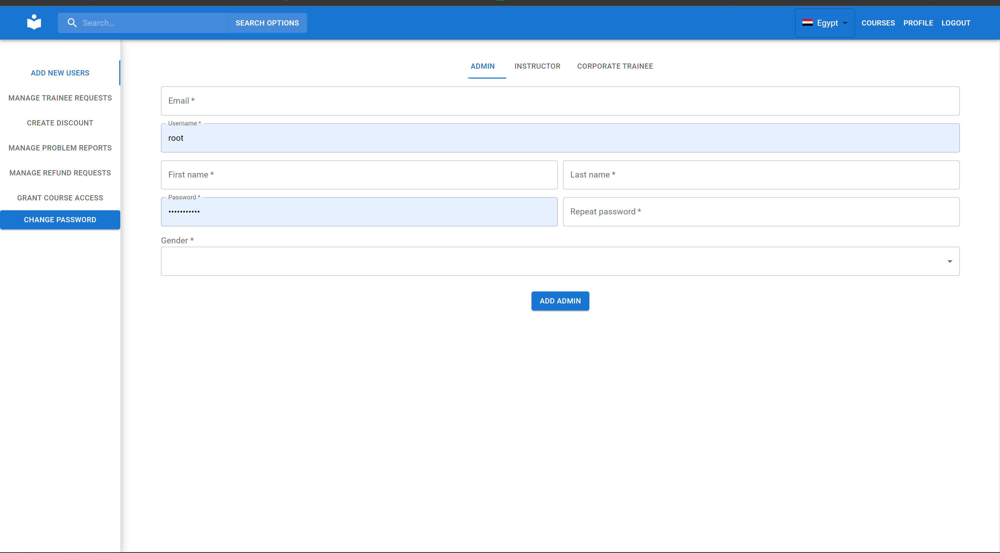

# Test-in-Evaluation

An Online Learning and Teaching Platform

## Motivation

We were assigned this project by Dr. Mervat for our CSEN 704 - Advanced Computer Lab course and we wanted to pass this course :)

## Build Status

All sprints done including functional and non-functional requirements

## Code Style

We used a prettier config file to ensure professional code formatting

## Screenshots

## Framework

We used the MERN (Mongo-Express-React-Nodejs) framework. We also used typescript for both the backend and the frontend

## Features

- Guests are allowed to use the site with limited functionality

- Signup to the website

- Receive a password reset email

- Corporations can use the platform with features tailored to corporate trainees to teach their employees

- Report, follow-up and resolve a problem all on the platform

- Rate courses and see other people'es ratings

- Filter courses by custom criteria

- Solve exercises on the platform and receive a grade

- Get a certificate when you complete a course

- View your wallet balance

- Set promotions as an admin or an instructor

- Create multiple choice exams as an instructor

- Add videos to your courses as an instructor

## Installation

1. Make sure you have `npm` and `node` installed

2. Go into the `server` directory and run `npm i`

3. Create a `.env` file, using `.env.example` as a template

4. Run `node .`

5. From the parent directory, go into the `client` directory and run `npm i`

6. Run `npm start`

## Use

After preforming the installation, simply navigate to the URL return by the `npm start` command

## Credits

### Test in Evaluation

Ahmed Mamdouh

Akram Fahim

Karim Mohamed

Mahmoud Gaber

Noureldin Hesham

## License

Private or ( whatever gives us the grade )
